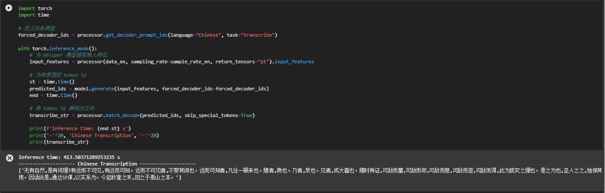

## ipex-llm 推理部署 旅游助手RAG应用

### 1. 平台选择
使用魔搭社区提供的免费云CPU资源 Intel(R) Xeon(R) Platinum 8369B CPU @ 2.70GHz，核心数8。

<p align="center">
    <br>
    
    <br>
</p>

### 2. 虚拟环境创建

```shell

git clone https://github.com/yaosenJ/ipex-llm_rag.git
cd ipex-llm_rag
bash install.sh
conda activate ipex

```
### 3. 环境依赖包安装

```shell

pip install modelscope
pip install streamlit
pip install llama-index-vector-stores-chroma llama-index-readers-file llama-index-embeddings-huggingface llama-index

```
### 4. 模型下载

运行下面代码块，即可下载Qwen-1.5B-Instruct
```python

import torch
from modelscope import snapshot_download, AutoModel, AutoTokenizer
import os
# 第一个参数表示下载模型的型号，第二个参数是下载后存放的缓存地址，第三个表示版本号，默认 master
model_dir = snapshot_download('Qwen/Qwen2-1.5B-Instruct', cache_dir='qwen2chat_src', revision='master')

```

### 5. 模型量化

运行下面代码块，即可对Qwen-1.5B-Instruct进行int4量化
```python

from ipex_llm.transformers import AutoModelForCausalLM
from transformers import  AutoTokenizer
import os
if __name__ == '__main__':
    model_path = os.path.join(os.getcwd(),"qwen2chat_src/Qwen/Qwen2-1___5B-Instruct")
    model = AutoModelForCausalLM.from_pretrained(model_path, load_in_low_bit='sym_int4', trust_remote_code=True)
    tokenizer = AutoTokenizer.from_pretrained(model_path, trust_remote_code=True)
    model.save_low_bit('qwen2chat_int4')
    tokenizer.save_pretrained('qwen2chat_int4')

```

### 6. 推理部署

streamlit run streamlit_app.py

<p align="center">
    <br>
    
    <br>
</p>

### 7. 功能模块

- ASR
- TTS
- 图生文
  
####  7.1 ASR

模型下载：[https://www.modelscope.cn/models/AI-ModelScope/whisper-large-v3](https://www.modelscope.cn/models/AI-ModelScope/whisper-large-v3)

```python
from modelscope import snapshot_download
model_dir = snapshot_download('AI-ModelScope/whisper-large-v3', cache_dir='./model/asr', revision='master' )
```

模型低精度**int4**量化
```python
from ipex_llm.transformers import AutoModelForSpeechSeq2Seq
from transformers import  AutoTokenizer

model =AutoModelForSpeechSeq2Seq.from_pretrained(pretrained_model_name_or_path="/mnt/workspace/A/AI-ModelScope/whisper-large-v3/",
                                                  load_in_4bit=True,
                                                  trust_remote_code=True)
model.save_low_bit('./model/asr/AI-ModelScope/whisper-large-v3_int4')
tokenizer.save_pretrained('./model/asr/AI-ModelScope/whisper-large-v3_int4')
```

加载量化版的**Whisper-large-v3**模型
```python
load_path = "./model/asr/AI-ModelScope/whisper-large-v3_int4"
model = AutoModelForSpeechSeq2Seq.load_low_bit(load_path, trust_remote_code=True)
```
加载 **Whisper Processor**

```python
from transformers import WhisperProcessor
processor = WhisperProcessor.from_pretrained(pretrained_model_name_or_path="./model/asr/A/AI-ModelScope/whisper-large-v3")
```
使用带有 INT4 优化功能的 **IPEX-LLM**优化 **Whisper-large-v3** 模型并加载 Whisper Processor 后，就可以开始通过模型推理转录音频了。
首先从原始语音波形中提取序列数据
```python
import librosa
data_en, sample_rate_en = librosa.load("audio_zh.mp3", sr=16000)
```
然后根据序列数据转录音频文件

```python
import torch
import time

# 定义任务类型
forced_decoder_ids = processor.get_decoder_prompt_ids(language="Chinese", task="transcribe")

with torch.inference_mode():
    # 为 Whisper 模型提取输入特征
    input_features = processor(data_en, sampling_rate=sample_rate_en, return_tensors="pt").input_features

    # 为转录预测 token id
    st = time.time()
    predicted_ids = model.generate(input_features, forced_decoder_ids=forced_decoder_ids)
    end = time.time()

    # 将 token id 解码为文本
    transcribe_str = processor.batch_decode(predicted_ids, skip_special_tokens=True)

    print(f'Inference time: {end-st} s')
    print('-'*20, 'Chinese Transcription', '-'*20)
    print(transcribe_str)
```
最后结果展示如下：
<p align="center">
    <br>
    
    <br>
</p>
####  7.3 图生文
```python
import torch
from modelscope import snapshot_download, AutoModel, AutoTokenizer
import os
# 第一个参数表示下载模型的型号，第二个参数是下载后存放的缓存地址，第三个表示版本号，默认 master
model_dir = snapshot_download('ZhipuAI/glm-4v-9b', cache_dir='model', revision='master')
from ipex_llm.transformers import AutoModelForCausalLM
from transformers import  AutoTokenizer
import os
if __name__ == '__main__':
    model_path = os.path.join(os.getcwd(),"/mnt/workspace/model/ZhipuAI/glm-4v-9b")
    model = AutoModelForCausalLM.from_pretrained(model_path, load_in_low_bit='sym_int4',  optimize_model=True,  trust_remote_code=True)
    tokenizer = AutoTokenizer.from_pretrained(model_path, trust_remote_code=True)
    model.save_low_bit('/mnt/workspace/glm-4v-9b-sym_int4')
    tokenizer.save_pretrained('/mnt/workspace/glm-4v-9b-sym_int4')
    print("保存完毕！")
import os
import time
import torch
import argparse
import requests

from PIL import Image
from ipex_llm.transformers import AutoModelForCausalLM
from transformers import AutoTokenizer

if __name__ == '__main__':
    # parser = argparse.ArgumentParser(description='Predict Tokens using `generate()` API for THUDM/glm-4v-9b model')
    # parser.add_argument('--repo-id-or-model-path', type=str, default="THUDM/glm-4v-9b",
    #                     help='The huggingface repo id for the THUDM/glm-4v-9b model to be downloaded'
    #                          ', or the path to the huggingface checkpoint folder')
    # parser.add_argument('--image-url-or-path', type=str,
    #                     default="http://farm6.staticflickr.com/5268/5602445367_3504763978_z.jpg",
    #                     help='The URL or path to the image to infer')
    # parser.add_argument('--prompt', type=str, default="What is in the image?",
    #                     help='Prompt to infer')
    # parser.add_argument('--n-predict', type=int, default=32,
    #                     help='Max tokens to predict')

    # args = parser.parse_args()
    # model_path = args.repo_id_or_model_path
    # image_path = args.image_url_or_path
    # model_path = "ZhipuAI/glm-4v-9b"
    image_path = "travel.png"

    # Load model in 4 bit,
    # which convert the relevant layers in the model into INT4 format
#     model = AutoModelForCausalLM.from_pretrained(model_path,
#                                                  load_in_4bit=True,
#                                                  optimize_model=True,
#                                                  trust_remote_code=True,
#                                                  use_cache=True)
    
#     tokenizer = AutoTokenizer.from_pretrained(model_path, trust_remote_code=True)
#      model = AutoModel.from_pretrained(model_path,
#                                       load_in_4bit=True,
#                                       trust_remote_code=True,
#                                       model_hub='modelscope')

#     # Load tokenizer
#     tokenizer = AutoTokenizer.from_pretrained(model_path,
#                                               trust_remote_code=True)

    query = "请你理解这张图片"
    if os.path.exists(image_path):
       image = Image.open(image_path)
    else:
       image = Image.open(requests.get(image_path, stream=True).raw)

    # here the prompt tuning refers to https://huggingface.co/THUDM/glm-4v-9b/blob/main/README.md
    inputs = tokenizer.apply_chat_template([{"role": "user", "image": image, "content": query}],
                                           add_generation_prompt=True,
                                           tokenize=True,
                                           return_tensors="pt",
                                           return_dict=True)  # chat mode
    inputs = inputs.to('cpu')
    
    # Generate predicted tokens
    with torch.inference_mode():
        gen_kwargs = {"max_length": 128, "do_sample": True, "top_k": 1}
        st = time.time()
        outputs = model.generate(**inputs, **gen_kwargs)
        outputs = outputs[:, inputs['input_ids'].shape[1]:]
        end = time.time()
        print(f'Inference time: {end-st} s')
        output_str = tokenizer.decode(outputs[0])
        print('-'*20, 'Output', '-'*20)
        print(output_str)
```
